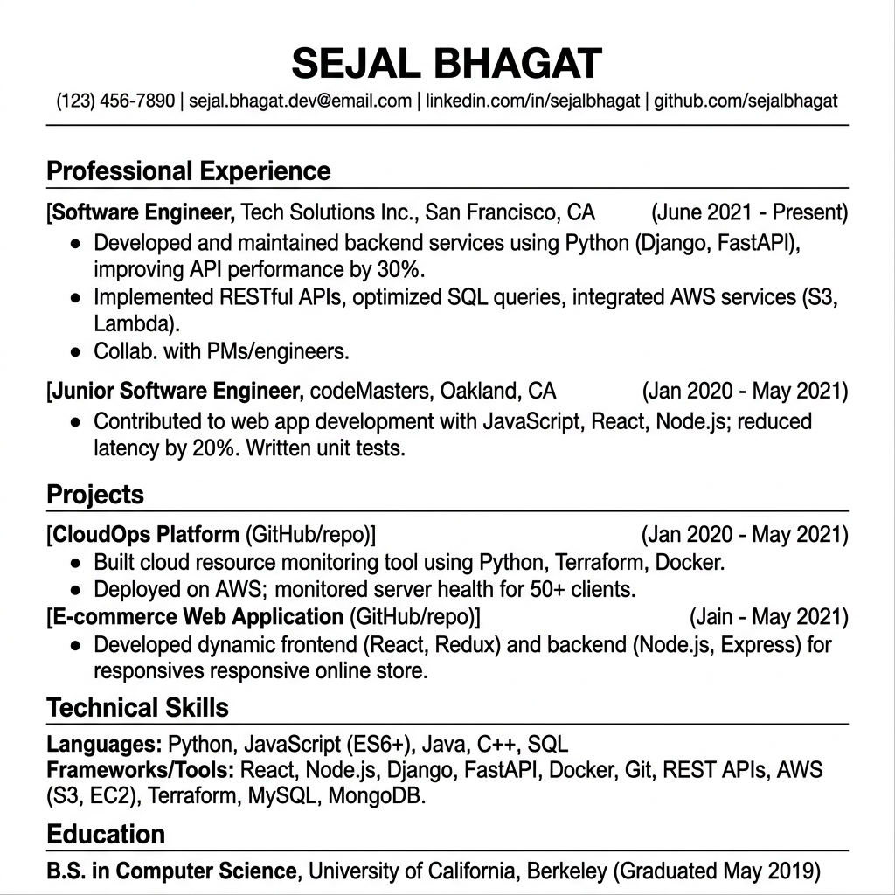
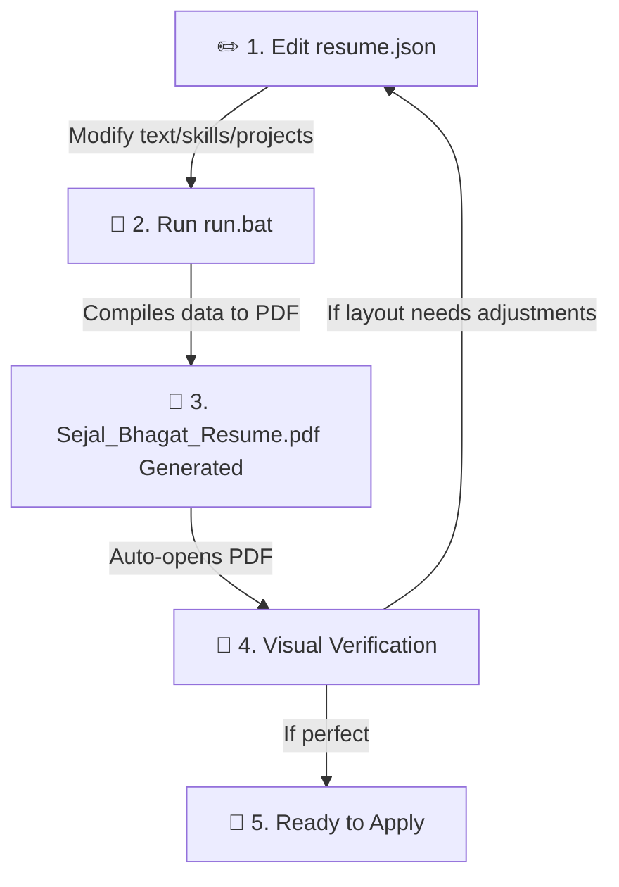

# 📄 Resume Generator: Project Guide & Workflow

This project is a **programmatic resume builder** designed to compile a beautifully formatted, single-page, ATS-friendly resume PDF from structured data.

---

## 🎨 Visual Preview

Here is a visual preview of the generated single-page vector PDF resume:



---

## 📂 What this Folder is For

This folder contains a lightweight automation system to manage and build your professional resume. Instead of using complex design software or standard word processors (which frequently suffer from layout shifts and page-overflow issues), you maintain your resume's content and design using **Resume-as-Code** principles:

### File Directory Breakdown

| File / Folder | Purpose | Description |
| :--- | :--- | :--- |
| 🗄️ [resume.json](file:///c:/Users/HP/Documents/resume-generator/resume.json) | **The Database** | Contains all your personal details, professional experience, projects, skills, and achievements in a clean, readable JSON structure. |
| ⚙️ [generate_resume.py](file:///c:/Users/HP/Documents/resume-generator/generate_resume.py) | **The Layout Engine** | Python script that loads data from `resume.json` and programmatically draws the styling rules, margins, and section structures. |
| ⚡ [run.bat](file:///c:/Users/HP/Documents/resume-generator/run.bat) | **Windows Helper Script** | An executable batch script. Double-clicking this compiles your code and automatically opens the generated PDF in your default viewer. |
| 📦 [requirements.txt](file:///c:/Users/HP/Documents/resume-generator/requirements.txt) | **Dependency List** | Lists the required Python packages (`reportlab` for PDF layout generation and `pypdf` for page-count checking). |
| 📕 [Sejal_Bhagat_Resume.pdf](file:///c:/Users/HP/Documents/resume-generator/Sejal_Bhagat_Resume.pdf) | **Compiled Output** | The professional single-page resume generated by the script, ready to be sent to recruiters. |

---

## 🛠️ The Value & Benefits of This Approach

* **No Layout Shifting:** Traditional editors (like Word or Google Docs) make it incredibly frustrating to fit everything onto exactly one page without ruining margins or text wrapping. This Python script programmatically ensures everything fits precisely into **one single page** with standard constraints.
* **ATS (Applicant Tracking System) Optimized:** The script outputs clean, standard Helvetica vector fonts and structure. There are no tables-within-tables or complex non-standard characters, allowing company recruiting software to parse your skills and experience.
* **Version Control Ready:** Since your resume is represented as JSON/Python files, you can track it via Git/GitHub, view line-by-line diffs of your changes over time, and keep backups easily.

---

## 🔄 Detailed Development Workflow



### 1. Edit (Modifying Content)
Open **[resume.json](file:///c:/Users/HP/Documents/resume-generator/resume.json)** in your editor.
* Add or update achievements, project links, or skill tags inside the JSON attributes.
* *Tip:* Keep your descriptions concise to keep the resume fitting onto exactly one page.

### 2. Compile (Building the PDF)
Run the script to rebuild your PDF. You have two options:
* **Double-click `run.bat`** in your file explorer.
* Or, run this in your terminal:
  ```powershell
  python generate_resume.py
  ```

### 3. Verify
Check the output PDF **[Sejal_Bhagat_Resume.pdf](file:///c:/Users/HP/Documents/resume-generator/Sejal_Bhagat_Resume.pdf)**. Ensure that:
* All text is formatted correctly.
* The layout fits beautifully on a single page without overflowing to page 2 (the script will show a `[WARNING]` in your console if it overflows).
* Hyperlinks (like GitHub/LinkedIn/Email) are fully functional.
